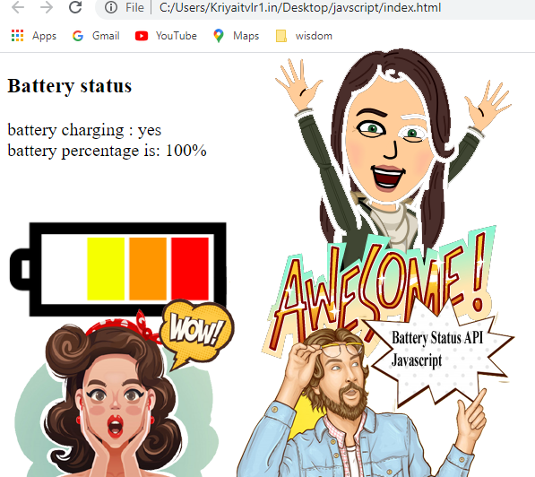

# Battery-Status-API
Battery Status API in javascript

 

The Battery Status API, more often referred to as the Battery API, provides information about the system's battery charge level and lets you be notified by events that are sent when the battery level or charging status change. This can be used to adjust your app's resource usage to reduce battery drain when the battery is low, or to save changes before the battery runs out in order to prevent data loss.

The Battery Status API extends window.navigator with a navigator.getBattery() method returning a battery promise, which is resolved in a BatteryManager object providing also some new events you can handle to monitor the battery status.

<h1>See video link: 
 https://youtu.be/zUQci6y4oP0
</h1>

